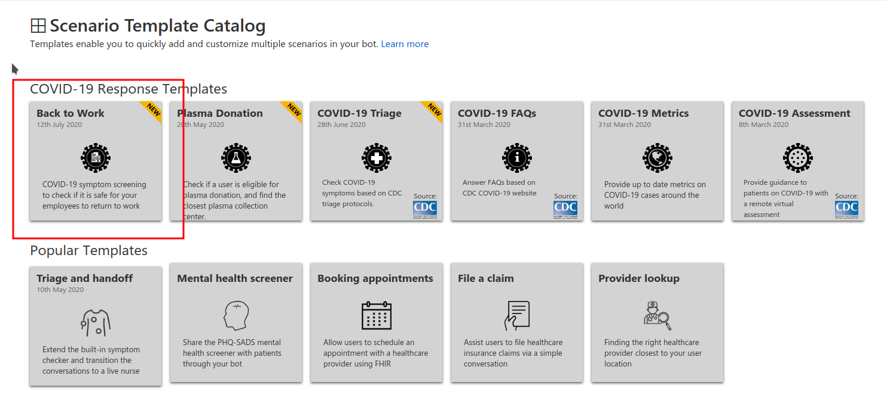
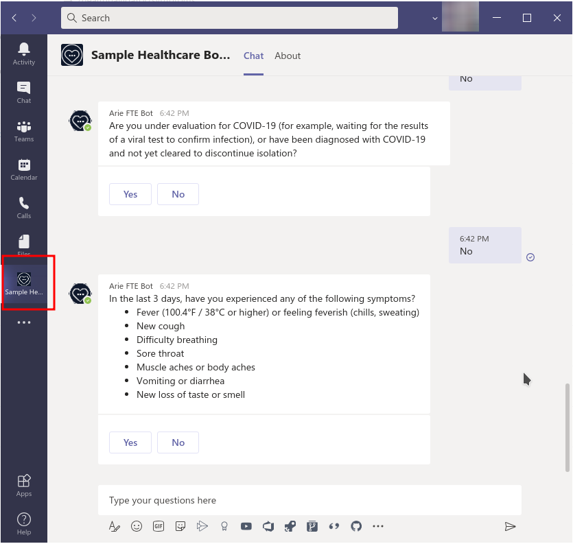

# Microsoft Teams Healthcare Bot Application

This application template will help you quickly deploy an instance of Healthcare Bot into your Teams organization channels and conversations.

For example: We can import the "Back to work" scenario from our Scenario Template Catalog and have it running in a few minutes.

To provision a Healthcare Bot Teams application, follow these steps:

### 1. [Purchase Healthcare Bot on Azure Marketplace](./docs/marketplace/marketplace.md)

### 2. [Configure Healthcare Bot for Microsoft Teams](./docs/portal/portal.md)
