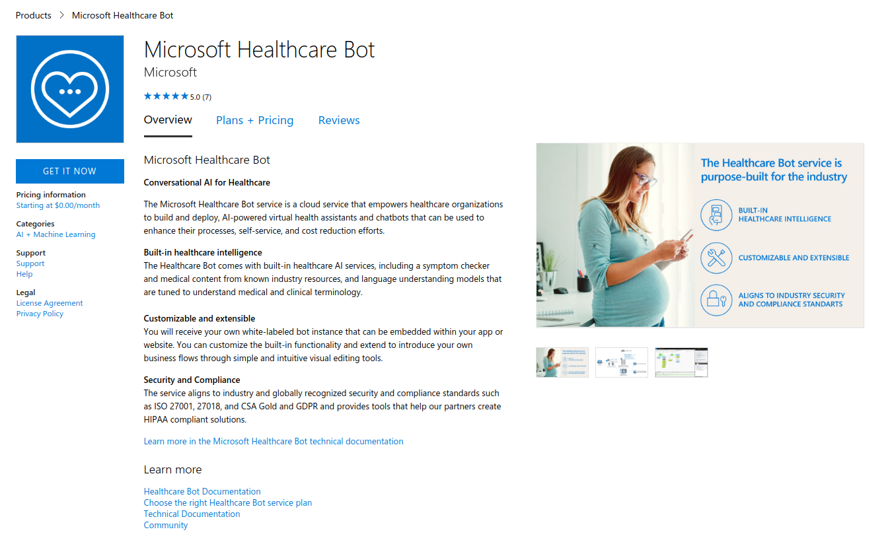
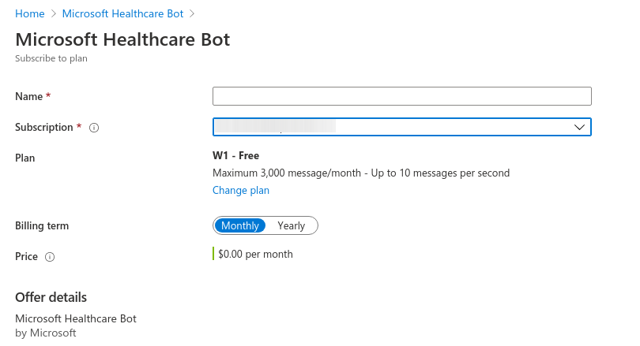
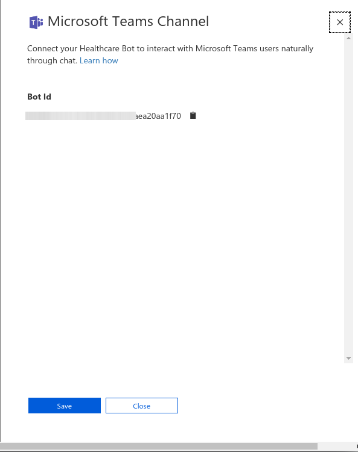

# Deployment

## 1. Create Healthcare Bot SaaS Application

 Click on the "GET IT NOW" button

Navigate to the [marketplace]([Marketplace](https://azuremarketplace.microsoft.com/en-us/marketplace/apps/microsoft-hcb.microsofthealthcarebot?tab=Overview)
) and create your Healthcare Bot application

Once redicted to the Azure Portal, select the Plan and click on the "Create" button

On the next page, give it a resource name. You also need to select the Azure subscription that will be used to charge the cost of the bot.

Notice that after the creation of this resource, you will not be able to find it under any of the Resource Groups. To see all your SaaS Applications, make sure you have addes a "Software as a Service (SaaS)" blade to the navigation panel as shown below.

## 2. Configuring your Healthcare Bot SaaS application

Locate the newly created resource and click it. Click the "Confgure Account" button as shown. This will take you to the Healthcare Bot's Owner portal where you can continue creating the actual Healthcare Bot resources.

At this point you can assign a name to the bot. You will have default name given by you  when you created the SaaS resource. This name will be used to generate a globally unique name that will identify this instance of the bot. Also, select the location of the provisioned resources. We currently support USA and EU locations. Click the "Create" button.

## 3. Configure Microsoft Teams channel
After logging into the Healthcare Bot portal, navigate to Integeation/Channels and enable the Teams channel

Copy the "Bot Id" into the clipboard and click on the "Save" button. You will need this Bot Id to paste into the Teams Application manifest file.

## 3. Create the Teams app packages

1. Open the [manifest\manifest.json](../../manifest/manifest.json) file in a text editor.
2. Change the placeholder fields in the manifest to values appropriate for your organization.
    * developer.name (What's this?)
    * developer.websiteUrl
    * developer.privacyUrl
    * developer.termsOfUseUrl

3. Change the `<bot id>` placeholder with the value you copied when configuring the Teams channel.

4. Create a ZIP package with the manifest.json,color.png, and outline.png. The two image files are the icons for your app in Teams.

    * Name this package HealthcareTeamsBot.zip.
    * Make sure that the 3 files are the top level of the ZIP package, with no nested folders.

## 3. Run the apps in Microsoft Teams
1. If your tenant has sideloading apps enabled, you can install your app by following the instructions [here](https://docs.microsoft.com/en-us/microsoftteams/platform/concepts/deploy-and-publish/apps-upload#load-your-package-into-teams)

2. You can also upload it to your tenant's app catalog, so that it can be available for everyone in your tenant to install. See [here](https://docs.microsoft.com/en-us/MicrosoftTeams/manage-apps)

3. Install the end-user app (the BookARoom-enduser.zip package) to your users.    