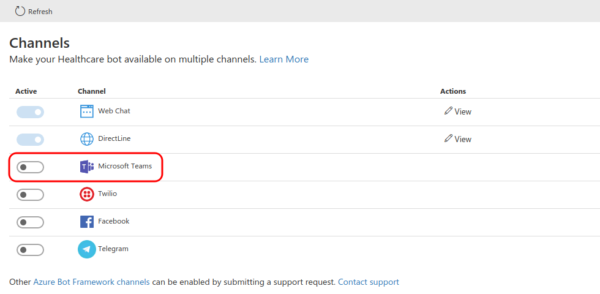

## 1. Configure Microsoft Teams channel
After logging into the Healthcare Bot portal, navigate to Integration/Channels and enable the Teams channel

Copy the "Bot Id" into the clipboard and click on the "Save" button. You will need this Bot Id to paste into the Teams Application manifest file.

## 2. Create the Teams app packages

1. Open the [manifest\manifest.json](../../manifest/manifest.json) file in a text editor.
2. Change the placeholder fields in the manifest to values appropriate for your organization.
    * developer.name (What's this?)
    * developer.websiteUrl
    * developer.privacyUrl
    * developer.termsOfUseUrl

3. Change the `<bot id>` placeholder with the value you copied when configuring the Teams channel.

4. Create a ZIP package with the manifest.json,color.png, and outline.png. The two image files are the icons for your app in Teams.

    * Name this package HealthcareTeamsBot.zip.
    * Make sure that the 3 files are the top level of the ZIP package, with no nested folders.

## 3. Run the apps in Microsoft Teams
1. If your tenant has sideloading apps enabled, you can install your app by following the instructions [here](https://docs.microsoft.com/en-us/microsoftteams/platform/concepts/deploy-and-publish/apps-upload#load-your-package-into-teams)

2. You can also upload it to your tenant's app catalog, so that it can be available for everyone in your tenant to install. See [here](https://docs.microsoft.com/en-us/MicrosoftTeams/manage-apps)

3. Install the end-user app (the HealthcareTeamsBot.zip package) to your users.    